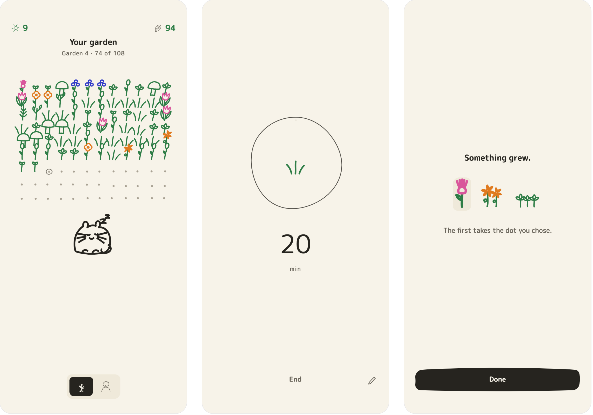
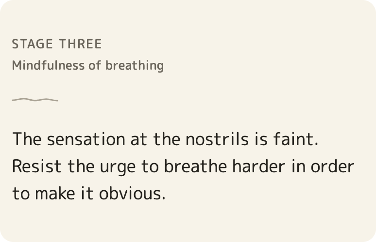
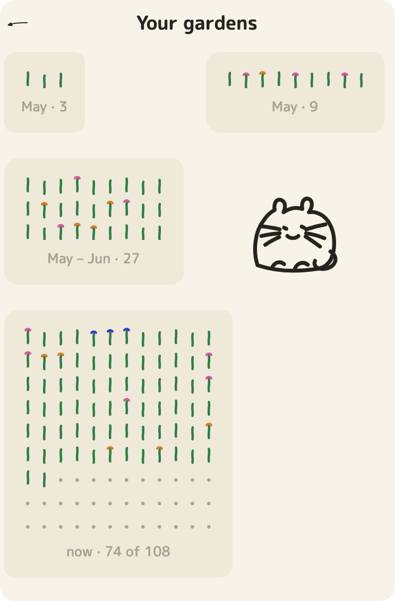

<div align="center">

# JustSit


[](LICENSE)

**A meditation app that never congratulates you.**

Wallace's ten stages of shamatha, taught slowly. Finish a sitting and something grows.

[Docs](docs/GUIDE.md) · [Design notes](CLAUDE.md) · [Parked ideas](TO-DOS.md)



</div>

## The garden


Every plant is one finished sitting. Leave one early and nothing grows. Nothing is
said about that either.

## Quick start with an agent

> Read `CLAUDE.md` first. It is long and it is the spec. Run `npm test` and
> `npm run typecheck` to see where things stand, then open `TO-DOS.md`, pick the
> entry you think is cheapest to land, and tell me which one and why before you
> write anything.

## Quick start

```sh
npm install
npm start        # then scan the QR code with Expo Go
```

Notifications are the one thing Expo Go cannot do.
[Why, and the build that can →](docs/GUIDE.md#expo-go-vs-a-standalone-build)

## Ten stages, one card at a time



The tips restate the practice rather than quoting it. The app offers the next stage
after twenty sittings across three weeks. Whether that stage describes your mind is
yours to decide.
[The rules, in a table →](docs/GUIDE.md#how-it-works)

## Every garden you kept



You pick the size each time one fills: 3 to start, then 9, 27, 54 or 108. A mala is
the largest there is.
[Where the arithmetic lives →](docs/GUIDE.md#where-things-live)

## Docs

Everything else is in **[docs/GUIDE.md](docs/GUIDE.md)**:
[running it](docs/GUIDE.md#running-it) ·
[how it works](docs/GUIDE.md#how-it-works) ·
[the art](docs/GUIDE.md#the-art) ·
[dev shortcuts](docs/GUIDE.md#dev-shortcuts).

## License

MIT. Drawn in Karakuli; the practice is B. Alan Wallace's.
